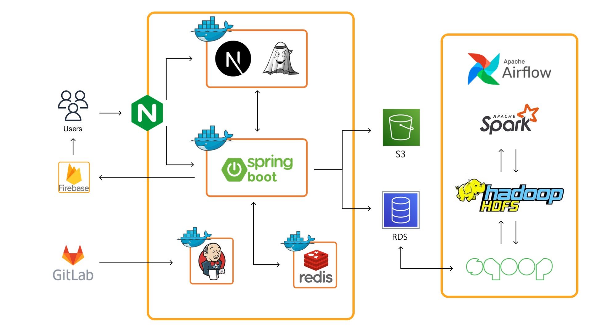

  

<h1 align="center"><strong>🤍쀼 : 보다 나은 우리를 위해🤍</strong></h1>
  

    <strong>부부 일정/추억 공유 애플리케이션</strong>
    
<a href="https://www.youtube.com/watch?v=yfxiEBpY8no">시연영상</a>

     
    <!--https://ileriayo.github.io/markdown-badges/-->
    

         
         
         
         
         
    

    

      
      
      
      
    

  

<h2 align="center"><strong>💙주요 기능💙</strong></h2>

✔️ 부부는 공유 일정(기념일, 부부 동반 약속)에 대한 리마인드 알림을 받는다.  
✔️ 공유 일정에 대해 추억을 작성할 수 있으며, 빅데이터 기술을 활용하여 장소를 추천받을 수 있다.  
✔️ 방문한 장소별로 추억을 회상할 수 있다.  
<h2 align="center"><strong>💙아키텍처💙</strong></h2>

   

<h2 align="center"><strong>💙핵심 기술💙</strong></h2>
<h3 align="center"><strong>1. RDS - Hadoop 파이프라인</strong></h3>

<h4 align="center"><strong>기술 선정 이유</strong></h4>
✔️ Hadoop : 대용량 데이터 적재    
✔️ Sqoop : RDS에서 장소 평점 데이터를 HDFS로 적재하기 위해 사용    
✔️ Spark : 인메모리 방식으로 처리하는 Spark를 사용하여 Hadoop의 연산 속도를 보완    
✔️ Airflow : 코드를 통해 파이프라인을 구현할 수 있음  

<h2 align="center"><strong>💙프로젝트 리뷰💙</strong></h2>
✔️ 추천 기능 고도화 (유저 기반 필터링을 사용한 추천 기능)  
✔️ 하둡 에코 시스템을 경험해볼 수 있었음  
 

<!-- Developers -->
<h2 align="center"><strong>💙담당 역할💙</strong></h2>

<table align="center" stlye="width: 80%; table-layout: fixed;">
  <tr align="center">
    <td style="text-align: center;"></td>
    <td style="text-align: center;"></td>
    <td style="text-align: center;"></td>
  </tr>
  <tr  align="center">
    <td style="text-align: center;"><a href="https://github.com/Eundms">박은정</a></td>
    <td style="text-align: center;"><a href="https://github.com/Giyoooon">권기윤</a></td>
    <td style="text-align: center;"><a href="https://github.com/wcyang8">양우철</a></td>
  </tr>
  <tr align="center">
    <td style="text-align: center;">추억, 알림,   유저, 인증/인가, 개발 편의 </td>
    <td style="text-align: center;">인프라 / 빅데이터 기술 / 부부인증 </td>
    <td style="text-align: center;">빅데이터 기술 / 일정, 장소 </td>
  </tr>
</table>

<a href="#readme-top">back to top</a>

